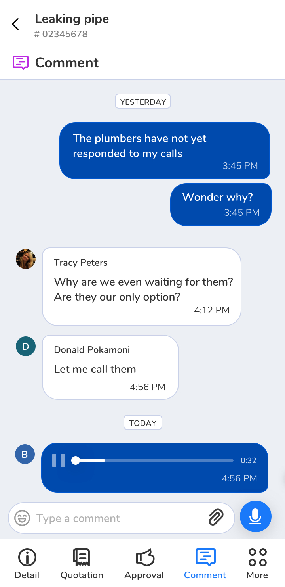
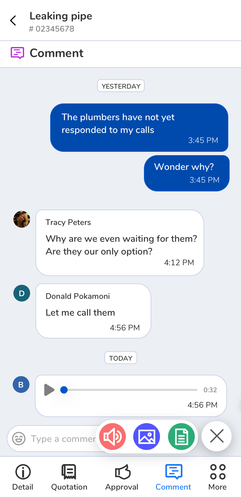
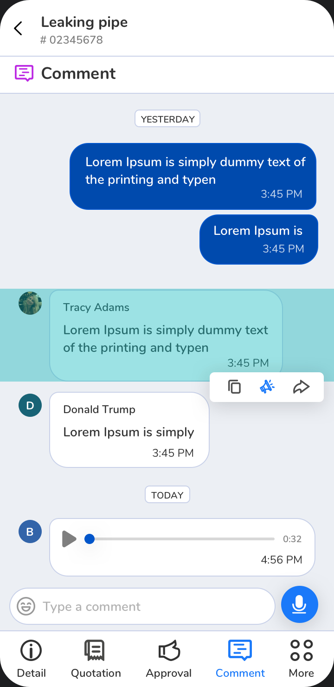
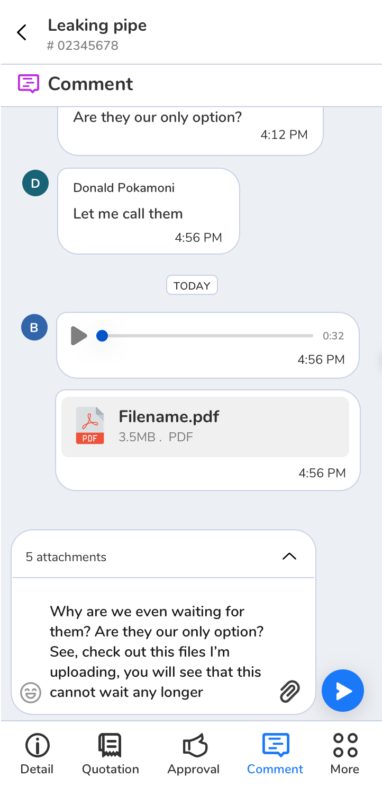

# Sysserve Solutions Front-end Engineer Assignment

Thanks for applying for the Front-end Engineer position at Sysserve!

This coding challenge will serve as the second step of technical evaluation in the hiring process, the goal is to show case how you work and if it is decided to proceed with the process, will lead to the last stage of our technical interview.

There are two parts to the challenge, the first is developing the visual components of a supplied design. The second part is about how you implement, test and explain business logic.

## Time to spend on the assignment

We don't assign a fixed time deadline for it, but after you’ve read the assignment, please let us know when you’re planning to complete it. After you complete the assignment we'll review it internally, and if we evaluate it to be positive, we'll schedule a technical interview to discuss the results together. As said, feel free to make some concessions under time pressure, just let us know what parts you've focused on most.

## Technology and Frameworks

This project is based on Angular as that is what we use here at Sysserve Solutions.

We use NgRx at Sysserve, but you're free to choose any state management technology you'd like.

Finally, we prefer to use a typed dialect such as TypeScript, so it is a plus for you to showcase the use of it, but you are allowed to use any JS flavor.

Styling can be done via CSS, or a CSS-in-JS framework of your choice.

## The assignment

Please note for this assignment you are not required to build any server side logic, you can build all logic in the client-side.

Please see the following screenshots for the designs to build. **building the bottom tab is not required**.

| Screen 1                             | Screen 2                             | Screen 3                             | Screen 4       
|--------------------------------------|--------------------------------------|--------------------------------------|--------------------------------------
|  |  |  | 

### Business requirements

#### Input and output
The component should receive its initial state as a json object, allow the user to update the state via manipulating the UI(sending comments and uploading files).
Ignore the audio recording functionality.

#### Functional requirements
These are the requirements the component need to abide to be deemed functional.

* On load and whenever a new comment is posted by the logged in user specifically, the chat should automatically scroll to buttom, displaying the most recent 
* Each chat on long press should be highlighted and display options as shown in screen 3
* Each chat bubble should be able to display as text, image or media
* On click of the attachment icon in the chat input field, show the floating menu that handles file upload as shown in screen 2
* Once user types in the chat input field, switch the mic icon to a send icon as shown in screen 4
* Enter key should also send the comment

#### Non Functional requirements
##### Usability
It should be evident to the user how to operate the component. We are here to help the user to understand what are their options and guide them.

##### Configurability
The exact functional requirements of the component can change in the future, aim to make the component configurable.

##### Testability
It is recommended to write automated tests (unit or integration) to verify and document the business logic.
We leave it up to you to decide which parts of the implementation should be covered by automated tests given the time constraints.

### Evaluation criteria

In general, treat us as your colleagues reviewing your solution, and - as much as you can within the time constraints - try to follow the practices you normally would for having your work reviewed by your peers.

We will evaluate the assignment according to the following aspects:

* Correctness, bug free implementation according to the requirements
* Code quality, how clean, readable, organized and future proof your code is
* Quality assurance, how much confidence your automated tests add to the implementation
* Visual implementation, how close your component implementation is to the supplied designs

Good luck! If you have any questions around the assignment, feel free to reach out :)
